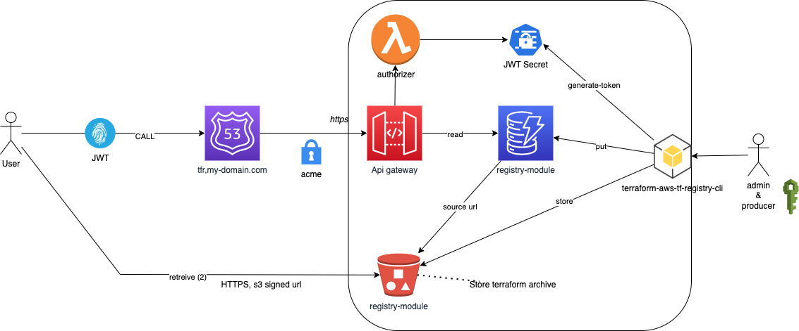

# aws-terraform-registry-cli

[](https://pypi.org/project/aws-terraform-registry)
[](https://pypi.org/project/aws-terraform-registry)

Versions following [Semantic Versioning](https://semver.org/)

## Overview

This project create a python client which work with [AWS Terraform Private Registry](https://github.com/geronimo-iia/terraform-aws-tf-registry).

Features:

- Show client configuration (for debug purpose)
- Authentication:
    - JWT Token generation
    - .terraformrc generation to configure Devops workstation
- Terraform module publication from external storage (like a githb module release)
- Terraform module release (more detail on it below) to store every module inside default bucket of the [AWS Terraform Private Registry](https://github.com/geronimo-iia/terraform-aws-tf-registry)..


See [documentation](https://geronimo-iia.github.io/terraform-aws-tf-registry-cli/).

The [AWS Terraform Private Registry](https://github.com/geronimo-iia/terraform-aws-tf-registry) follow this Architectural design:




## Installation

Install this library directly into an activated virtual environment:

```text
$ python3 -m pip install terraform-aws-tf-registry-cli
```

## Configuration

We have to provide few informations to this client :


| Name                | Description                                                         |
|---------------------|---------------------------------------------------------------------|
| secret_key_name     | AWS Secret manager name where JWT Secret is stored                  |
| repository_url      | HTTPS endpoint of the registry                                      |
| dynamodb_table_name | AWS dynamodb table name                                             |
| bucket_name         | bucket name                                                         |
| default_namespace   | default namespace to publish terraform module ("devops" per default) |
|                     |                                                                     |


All this information can come from several way (choose the rigth for you):

- from a yaml configuration file 
- from environment variable

> Yaml configuration can be overriden with environment variable.


### YAML configuration

The default file name is `terraform_registry.yaml`, you can override this with `TFR_CONFIG_FILE` environmentt variable.

To find thie configuratin file, directories will be lookup in this order:

- user home directory
- command line directory
- `/etc/tfr` 

### Environment variable


| Name                | Enviromnent variable name |
|---------------------|---------------------------|
| secret_key_name     | TFR_SECRET_KEY_NAME       |
| repository_url      | TFR_REPOSITORY_URL        |
| dynamodb_table_name | TFR_DYNAMODB_TABLE_NAME   |
| bucket_name         | TFR_BUCKET_NAME           |
| default_namespace   | TFR_DEFAULT_NAMESPACE     |
|                     |                           |

All environment variable can be set with `.env` file inside your command line directory.


## Usage

```bash
> tfr
usage: tfr [-h] {config,generate-token,generate-terraformrc,publish,release} ...

Manage terraform registry

positional arguments:
  {config,generate-token,generate-terraformrc,publish,release}
                        commands
    config              Show configuration parameters
    generate-token      Generate an access token
    generate-terraformrc
                        Generate terraformrc configuration file
    publish             Publish a terraform module from custom source.
    release             Release a terraform module from custom source.

optional arguments:
  -h, --help            show this help message and exit
  ```

### Configuration

You can print what the python client use as configuration with the command :

`tfr config`

Example with an empty configuration:

```bash
bucket_name: null
default_namespace: devops
dynamodb_table_name: null
repository_url: null
secret_key_name: null
```

### Authentication

#### Obtain a JWT token

Command :

```bash
usage: tfr generate-token [-h] [-weeks WEEKS]

optional arguments:
  -h, --help            show this help message and exit
  -weeks WEEKS, --weeks WEEKS
                        #weeks of validity (52 per default)
```

#### Configure terraform with your private registry

Users must create `.terraformrc` file in their $HOME directory, with this content:

```hcl
credentials "registry.my-domain.com" {
    token = "Mytoken"
}
```

Command :

```bash
usage: tfr generate-terraformrc [-h] -output-directory OUTPUT_DIRECTORY [-weeks WEEKS]

optional arguments:
  -h, --help            show this help message and exit
  -output-directory OUTPUT_DIRECTORY, --output-directory OUTPUT_DIRECTORY
                        output directory
  -weeks WEEKS, --weeks WEEKS
                        #weeks of validity (52 per default)

```

## Terraform & Publication


You have two way to publish a module, using:

- `publish`
- `release`

What's the difference ?

> `publish`: register the source module as is in the aws private terraform regstry. You could have access issue if this url is not public.

> `release`: 
>
>    - store the source into the dedicated bucket of aws private terraform regstry. The access is managed within registry.
>    - archive (targ.gz) if the source is a folder
>    - download the source if it's an http utl

We use `release` from our ci/cd pipeline and `publish` when we have to do something like 'quick and dirty' ... (It never happen, I swear !)


### Publish command

```bash
usage: tfr publish [-h] [-namespace NAMESPACE] -name NAME -system SYSTEM -version VERSION -source SOURCE

optional arguments:
  -h, --help            show this help message and exit
  -namespace NAMESPACE, --namespace NAMESPACE
                        module namespace
  -name NAME, --name NAME
                        module name
  -system SYSTEM, --system SYSTEM
                        module system (aws, ...)
  -version VERSION, --version VERSION
                        module version
  -source SOURCE, --source SOURCE
                        module source
```

### Release command

```bash
usage: tfr release [-h] [-namespace NAMESPACE] -name NAME -system SYSTEM -version VERSION -source SOURCE

optional arguments:
  -h, --help            show this help message and exit
  -namespace NAMESPACE, --namespace NAMESPACE
                        module namespace
  -name NAME, --name NAME
                        module name
  -system SYSTEM, --system SYSTEM
                        module system (aws, ...)
  -version VERSION, --version VERSION
                        module version
  -source SOURCE, --source SOURCE
                        module source
```


